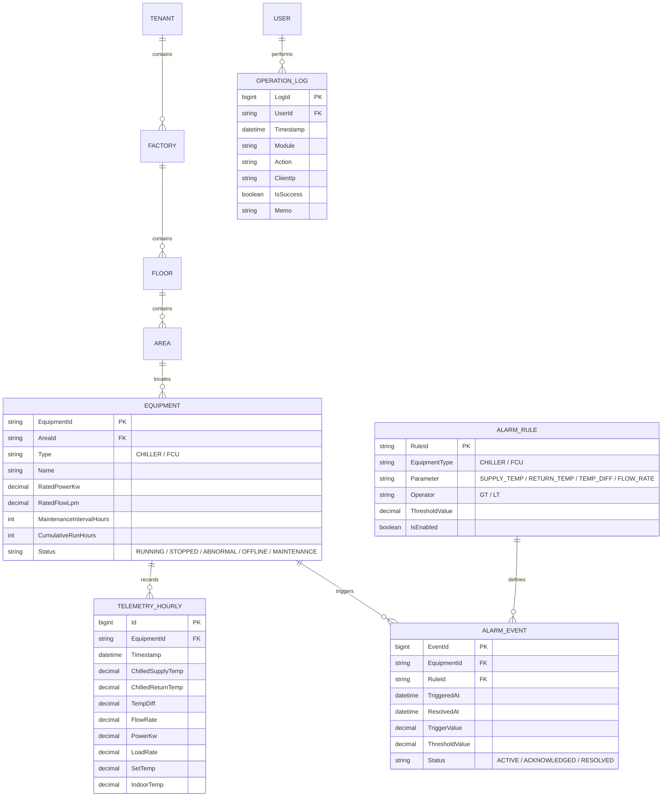

# 東元電機智慧環境監控系統 (TECO Smart HVAC Environmental Monitoring System)
## Figma 完整需求規格與詳細圖層解析規範書 (System Requirement Specification / SRS)

---

> ⚠️ **本文件為專案初期依 Figma 設計稿撰寫的規格書，多處內容已被後續技術驗證推翻，不再是目前的
> 架構現況**，包括但不限於：雙資料庫架構（實際是單一 MariaDB）、FCU 設定溫度／溫差公式（供應商
> SDK 沒有設定溫度，實際改用絕對室溫上下限）、水流量欄位（供應商 SDK 沒有這個量測值，已刻意
> 拿掉）、固定密碼 `12345@ABC`（實際是隨機產生的臨時密碼）、資料庫 ERD 與前後端資料夾結構
> （實際結構見 `CLAUDE.md`「專案邊界」）。**目前唯一權威來源是
> [`backend/README.md`](../backend/README.md) 與 [`docs/BACKEND_INTEGRATION_PLAN.md`](BACKEND_INTEGRATION_PLAN.md)**，
> 本文件僅保留供追溯 Figma 原始設計意圖與 UI 文案之用，內容如與上述兩份文件衝突，一律以
> 上述兩份文件為準。

---

## 壹、系統願景與架構定位

本系統為「東元電機智慧環境監控」專用之工業物聯網 (IIoT) 與 HVAC 暖通空調節能監控戰情室平台。
系統依據 Figma 設計規範（File Key: `rkUjbLhosU30ba9hoBog18`）建構，提供多層級廠區/樓層空間拓撲、
設備即時監控、獨立閾值判定、報表分析與使用者權限管理。**下方架構圖為初期規劃的雙資料庫構想，
實際實作是單一 MariaDB（原因見 `docs/BACKEND_INTEGRATION_PLAN.md` §6.1），僅供參考原始設計意圖。**

```mermaid
flowchart TD
    subgraph 前台戰情室 [前台 HVAC Monitoring Dashboard (1920x1080)]
        Header[頂部 Header / 告警鈴鐺通知]
        Overview[總覽指標: 冰水主機運轉 / FCU 啟用數 & 運轉率 %]
        RealtimeAlarm[即時告警輪播區 (超過2筆自動輪播)]
        FloorViewer[樓層定時輪播 B1/B2 & 設備平面監控]
        ChillerCards[冰水主機卡片 (實測溫差/流量/負載率/紅字)]
        FCUCards[FCU 卡片 (設定溫/室溫/溫差/運轉模式)]
    end

    subgraph 後台管理系統 [後台 Management Console]
        ThresholdSetting[溫度設定＆超標警示 (獨立事件/全場FCU共用溫差)]
        FormulaEngine[運算公式引擎 (formula-spec: 溫差/負載率/告警)]
        ReportEngine[4 大報表引擎 (日/週報表/小時折線圖/空狀態)]
        ChillerReport[冰水主機運轉日/週報表]
        FCUReport[FCU 運轉日/週報表]
        AlarmReport[異常告警歷史報表]
        OpLog[操作日誌 Audit Log]
        UserManager[使用者管理 & 密碼重設]
    end

    subgraph 資料庫與邊界 [初期規劃構想，實際為單一 MariaDB]
        PlatformDB[(Platform DB: 帳號/角色/權限/Audit)]
        CustomerDB[(Customer DB: 廠區樓層/設備台帳/時序數據/告警)]
    end

    前台戰情室 --> CustomerDB
    後台管理系統 --> PlatformDB
    後台管理系統 --> CustomerDB
```

---

## 貳、「前台」頁面（Page: 前台, ID: `0:1`）完整規格

### 一、畫面規格與色彩體系
- **標準解析度**：`1920 x 1080 px`（全螢幕固定尺寸戰情室看板）。
- **色彩體系定義**：
  - **背景主色 (Base Background)**：Dark Theme 深色基調（`#0D1117`、`#161B22`、`#1E293B`）。
  - **運轉正常 (Running)**：綠色 Badge / 文字（`#52C41A` / `#10B981` / `#2EA043`）。
  - **異常告警 (Alarm / Error)**：紅色 Badge / 紅字數值（`#FF4D4F` / `#EF4444` / `#F85149`）。
  - **設備停止 (Stopped)**：灰色 Badge / 文字（`#8C8C8C` / `#6B7280` / `#6E7681`）。
  - **設備離線 (Offline)**：淺灰色 / 虛線狀態（`#94A3B8` / `#595959` / `#DB6D28`）。
  - **待保養 (Maintenance)**：黃色 / 琥珀色 Badge（`#FAAD14` / `#FFC943` / `#D29922`）。
  - **連線 / 強調標註線條**：黃色外框與連線（`#FFC943`）。

---

### 二、頂部導覽列 (Header Bar)
1. **系統標題**：東元電機智慧環境監控 (TECO Smart HVAC Environmental Monitoring)。
2. **即時時鐘**：格式 `YYYY/MM/DD HH:mm:ss`，每秒即時跳動。
3. **樓層切換選單**：
   - 下拉選項：`全部(預設)`、`B1`、`B2`。
   - 連動機制：切換樓層時，畫布與下方所有設備卡片、列表連動篩選。
4. **即時告警鈴鐺通知 (Alarm Bell)**：
   - **紅點規則**：若系統偵測到「新的未檢視異常項目」，鈴鐺圖示右上角出現紅色 Alert Dot。
   - **互動行為**：點擊鈴鐺自動彈出「查看全部告警」Modal 彈窗；用戶查看後紅點自動消除。
5. **功能捷徑**：全螢幕切換按鈕、進入後台管理系統按鈕。

---

### 三、總覽數據卡片與指標 (Dashboard Overview Cards)

#### 1. 冰水主機卡片 (Chiller Cards)
- **設備識別**：冰水主機 1、冰水主機 2 ... 等。
- **狀態標籤 (Status Badge)**：
  - `運轉中` (綠)、`停止` (灰)、`異常` (紅)、`離線` (灰/虛線)、`待保養` (黃)。
- **即時數值監控指標**：
  - **出水溫度**（°C，感測值 $X$）
  - **回水溫度**（°C，感測值 $Y$）
  - **溫度差 $\Delta T$**（°C，計算式：$\text{回水} - \text{出水} = Y - X$）
  - **水流量**（LPM 或 $\text{m}^3/\text{h}$）
  - **耗電功率**（kW）
  - **負載率**（%，計算式見後台公式章節）
  - **累積運轉時數**（hrs，超過設定保養門檻提示「待保養」）
- **紅字警示規則**：出水溫度、回水溫度、溫度差、水流量若超出後台設定之安全範圍，該數值在卡片上立即呈現**紅字粗體 (`#FF4D4F` / `#F85149`)**，機台狀態切換為**異常**。

#### 2. FCU 統計與卡片 (FCU Cards & Overview)
- **總體統計指標**：
  - **FCU 啟用數**
  - **FCU 運轉率**：顯示百分比與台數比例，例如 `83.3% (20/30台)`
- **FCU 單機卡片**：
  - 設備編號（例如 `FCU-001` ~ `FCU-030`）
  - 所屬樓層（`B1` / `B2`）
  - 狀態標籤（`運轉中`、`停止`、`異常`、`離線`、`待保養`）
  - **室內溫度**（°C）
  - **設定溫度**（°C）
  - **溫度差 $\Delta T$**（°C，計算式：$\text{室內溫度} - \text{設定溫度}$）
  - **運轉模式**（冷氣、暖氣、送風）
  - **風速**（強、中、弱、自動）
- **版面排版規則（源自 Palmira 留言）**：
  - 將樓層區塊放大，FCU 啟用數與運轉率置於上方，即時告警網置於下方，確保各樓層區域視覺清晰。
- **前台控制項精簡（2026-08-17 決策）**：
  - 前台面板**拿掉電源開關、設定溫度、運轉模式、風速切換**等直接控制項，純粹作為環境品質與溫差即時監控。

#### 3. 輪播組件機制 (Carousel / Rotation)
- **樓層輪播**：預設啟用 `B1`、`B2` 定時自動輪播切換展示（亦支援手動點選切換鎖定）。
- **告警輪播**：若當前未解除即時告警項目**超過兩筆**，系統自動啟動定時水平輪播機制。

---

### 四、「查看全部告警」彈窗 (Active Alarms Modal)
- **Modal Header**：
  - 標題：`全部告警`
  - 數量標籤：`alarm-count-badge`（顯示當前告警總筆數）
  - 關閉按鈕：右上角 `X` 關閉點擊區
- **告警表格欄位**：
  1. **時間**：告警發生時間（例如 `2026/08/18 10:23`）
  2. **設備名稱**：發生異常之設備（例如 `FCU-001`、`冰水主機 1`、`FCU-003`、`FCU-012`）
  3. **異常項目 / 數值**：超標項目（如出水溫度過高、FCU溫差過大）與當時測量值
  4. **狀態**：異常狀態標籤
- **告警生命週期邏輯**：
  - 若設備狀態恢復正常範圍（運轉中），該告警即時自彈窗與即時告警輪播列中**自動移除**。
  - 歷史告警紀錄永久完整保留於「異常告警報表」供追溯。

---

### 五、狀態對照表規範（Status Reference Matrix）
系統完整定義 **8 種狀態**：
- **共用狀態（4 個）**：
  1. **運轉中 (Running)**（綠色 `#52C41A` / `#10B981`）：設備正常開機運轉中。
  2. **停止 (Stopped)**（灰色 `#8C8C8C` / `#6B7280`）：設備手動關機或排程停止。
  3. **異常 (Abnormal)**（紅色 `#FF4D4F` / `#EF4444`）：數值超出安全門檻。
  4. **離線 (Offline)**（灰色 `#595959` / `#94A3B8`）：通訊中斷，無感測數據回傳。
- **冰水主機專屬 / 細分狀態（4 個）**：
  5. **溫度差過高**（紅字/紅色 Badge）：$\Delta T > \text{上限}$。
  6. **溫度差過低**（紅字/紅色 Badge）：$\Delta T < \text{下限}$。
  7. **待保養**（黃色 `#FAAD14` / `#FFC943`）：累積運轉時數超過預設上限。
  8. **流量異常**（紅字/紅色 Badge）：水流量高於上限或低於下限。
- **FCU 專屬說明**：FCU 溫差異常直接對應於室內溫度與設定溫度之差值超標。

---

## 參、「後台」頁面（Page: 後台, ID: `55:128`）完整規格

### 一、公式定義規格 (`formula-spec` / `node_id: 459-5796`)

#### 1. 冰水主機溫差與告警計算
- **Sensor 實際測量值**：
  - 出水 Sensor 測量值：$X$
  - 回水 Sensor 測量值：$Y$
- **系統自動計算溫度差**：
  $$\Delta T = Y - X \quad (\text{回水溫度} - \text{出水溫度})$$
- **Alarm Rule 警示判斷規則（範例門檻）**：
  - 出水溫度 $X$：超出 $5 \sim 10^\circ\text{C}$ $\rightarrow$ 異常
  - 回水溫度 $Y$：超出 $15 \sim 25^\circ\text{C}$ $\rightarrow$ 異常
  - 溫度差 $Y - X$：超出 $7 \sim 10^\circ\text{C}$ $\rightarrow$ 異常
- **呈現規則**：超出設定範圍立即發出異常告警，後台報表與前台看板中異常數值**均以紅字呈現**。

#### 2. FCU 溫差與告警計算
- **計算式**：
  $$\Delta T = \text{室內溫度} - \text{設定溫度}$$
- **關聯規則**：
  - 使用者於後台設定 $\Delta T$ 安全範圍並儲存後，系統更新溫差判斷規則。
  - 當 $\Delta T$ 超出範圍，設備標記為「異常」，並連動反映於：
    1. 前台看板之「溫度差」欄位（紅字）
    2. 設備卡片之「狀態」標籤（異常）
    3. 報表查詢「運轉狀態 $\rightarrow$ 異常」之篩選結果

#### 3. 冰水主機負載率計算
- **計算公式**：
  $$\text{負載率 (\%)} = \frac{\text{當前製冷量 (RT)}}{\text{額定製冷量 (RT)}} \times 100\% \quad \text{或} \quad \frac{\text{當前實測耗電功率 (kW)}}{\text{主機額定功率 (kW)}} \times 100\%$$
  $$\text{亦可採用熱量法：} \text{Load Rate} = \frac{\text{水流量} \times (Y - X) \times C}{\text{額定容量}} \times 100\%$$

---

### 二、溫度設定＆ 超標警示（核心參數設定）

1. **獨立事件原則（Independent Alarm Rules，2026-08-18 決策）**：
   - 各參數設定互為**獨立事件**，每一項數值均有獨立的判斷開關與數值門檻。
   - 所有的數值皆支援設定**高於（大於）**某值或**低於（小於）**某值。
2. **冰水主機參數設定欄位**：
   - **出水溫度警示門檻**：上限值 (°C) / 下限值 (°C)
   - **回水溫度警示門檻**：上限值 (°C) / 下限值 (°C)
   - **溫度差 $\Delta T$ 警示門檻**：上限值 (°C) / 下限值 (°C)
   - **水流量警示門檻**：上限值 / 下限值 (LPM 或 $\text{m}^3/\text{h}$)
   - **累積運轉時數保養門檻**：設定小時數（達標後觸發「待保養」）
3. **FCU 參數設定欄位**：
   - **全域共用溫差設定（2026-08-17 決策）**：所有 FCU 共用一組溫度差 $\Delta T$ 設定，不再需要個別設定。
   - **室內溫度超標警示**：高溫警戒值 (°C) / 低溫警戒值 (°C)。
4. **按鈕與互動狀態規範**：
   - **儲存設定按鈕**：
     - **預設狀態**：`disabled`（灰底禁用）。
     - **變更狀態**：表單有任何修改時變為 `enabled`（可點擊儲存）。
   - **重置按鈕**：提供「恢復系統預設參數」功能，一鍵回復至系統原廠標準值。

---

### 三、後台各報表與表格欄位定義

#### 1. 冰水主機運轉報表（日報表 / 週報表 / 日折線圖 / 週折線圖）
- **篩選條件**：
  - **設備名稱**：單一機台選擇（下拉：`冰水主機 1 (預設)`、`冰水主機 2`）
  - **日期區間**：日報表 / 週報表（DatePicker，最小時間間隔為**每小時**）
  - **最大查詢範圍**：**一年**
  - **重置按鈕**：回復預設查詢條件
- **表格表頭與欄位**：
  1. 日期時間（小時區間）
  2. 出水溫度（°C，超標紅字）
  3. 回水溫度（°C，超標紅字）
  4. 溫度差 $\Delta T$（°C，超標紅字）
  5. 水流量（超標紅字）
  6. 負載率（%）
  7. 累積運轉時數（hrs）
  8. 運轉狀態（運轉中/停止/異常/離線/待保養）
- **圖表視圖**：提供日折線圖與週折線圖，同步對應小時數據。
- **空狀態 (Empty State)**：`冰水主機運轉報表-日報表-查無資料`（顯示無資料插畫與「目前查無相符資料」提示文字）。

#### 2. FCU 運轉報表（日報表 / 週報表 / 日折線圖 / 週折線圖 / 週折線圖-跨日）
- **篩選條件**：
  - **樓層**：`全部(預設)`、`B1`、`B2`
  - **設備名稱**：連動樓層選項（樓層改變時，設備名稱下拉自動更新），單選查詢
  - **設備狀態（可複選）**：`全部(預設)`、`運轉中`、`停止`、`異常`、`離線`
  - **日期區間**：日 / 週（以小時為單位，支援跨日折線圖）
  - **每頁筆數**：`20`、`50`、`100` 筆
  - **最大查詢範圍**：**一年**
  - **重置按鈕**：回復預設值
- **表格表頭與欄位**：
  1. 時間（小時）
  2. 樓層（B1 / B2）
  3. 設備編號/名稱（例如 FCU-001）
  4. 室內溫度（°C，超標紅字）
  5. 設定溫度（°C）
  6. 溫度差 $\Delta T$（°C，超標紅字）
  7. 運轉模式（冷氣/暖氣/送風）
  8. 風速（強/中/弱/自動）
  9. 設備狀態
- **空狀態**：`FCU運轉報表-日報表-查無資料`。

#### 3. 異常告警報表 (Alarm History Report)
- **篩選條件**：樓層、設備類型（冰水主機/FCU）、設備名稱、告警類型、時間範圍（日/週/自訂，上限一年）。
- **表格欄位**：
  1. 告警發生時間
  2. 告警解除時間（若已恢復）
  3. 樓層
  4. 設備名稱
  5. 告警項目（如：出水溫度過高、FCU溫差過大）
  6. 觸發數值（實際測量值）
  7. 警示門檻值（設定值）
  8. 持續時長
  9. 處理狀態（未處理/已確認/已解除）
- **空狀態**：`異常告警報表-查無資料`。

#### 4. 操作日誌 (`operation-log`)
- **篩選條件**：操作人員帳號、動作模組、時間範圍。
- **表格欄位**：
  1. 操作時間（精確至秒）
  2. 操作帳號
  3. 使用者名稱
  4. IP 位址
  5. 操作模組（如：溫度設定、使用者管理、設備台帳）
  6. 動作說明（例如：修改溫度差門檻、重設使用者密碼）
  7. 異動前數值
  8. 異動後數值
  9. 執行結果（成功 / 失敗）
- **空狀態**：`operation-log-查無資料`。

#### 5. 設備台帳管理 (Chiller & FCU Management)
- **冰水主機台帳欄位**：設備編號、設備名稱、廠牌型號、額定容量、安裝樓層、通訊 IP/Port、保養週期門檻、啟用狀態、操作（編輯/查看）。
- **FCU 台帳欄位**：設備編號、設備名稱、所屬樓層、區域位置、控制器型號、連線狀態、操作。
- **空狀態**：`fcu-management-empty-state`。

#### 6. 使用者管理與密碼修改 (User Management & Password Security)
- **權限與重設密碼規則（2026-08-17 決策）**：
  - 具備使用者管理權限之管理員，在列表操作欄中擁有**【重設密碼】**按鈕。
  - **重設密碼預設值**：點擊重設密碼後，密碼一律強制重設為 **`12345@ABC`**。
- **個人修改密碼功能**：
  - 每一位登入系統的使用者均可進入 `change-password` 頁面/彈窗自行修改密碼。
  - 欄位包含：目前密碼、新密碼、確認新密碼、儲存變更按鈕。
- **使用者列表欄位**：帳號、姓名、角色（管理員/一般檢視者）、信箱、建立時間、狀態（啟用/停用）、操作（編輯/重設密碼/停用）。

---

## 肆、畫布備註說明與 QA 討論匯整 (Canvas Q&A Specs)

畫布上標記的所有關鍵規格說明：
1. **即時告警狀態有哪些？**
   - 回覆：`停止`、`異常`（出水溫度過高/低、回水溫度過高/低、溫度差過高/低、水流量過高/低）、`離線`、`待保養`（累積運轉超過預設值）。
2. **室內溫度超標警告有哪些？**
   - 回覆：`停止`、`異常`（室溫過高、室溫過低）、`離線`。
3. **報表查詢日期最小單位？**
   - 回覆：僅保留**日**和**週**的查詢，均以**小時**為單位，折線圖顯示（參考義大容留專案）。
4. **FCU 運轉模式有哪些？**
   - 回覆：`冷氣`、`暖氣`、`送風`。
5. **是否需要預設系統參數？**
   - 回覆：**需要**，點擊重置時回復系統預設參數。
6. **超出數值發警報條件？**
   - 回覆：超出設定值時（出水溫度、回水溫度、溫度差、水流量大於或小於設定門檻）立即發送警報。
7. **即時告警觸發與消除條件？**
   - 回覆：觸發條件為即時數值高於或低於設定值；若數值恢復正常（運轉中），即時告警自動移除，歷史紀錄留存於報表。

---

## 伍、Comments 討論留言全量紀錄 (Palmira 等人)

| ID | 作者 | 對應 Node ID | 留言內容 | 處理狀態 / 規格落實 |
|---|---|---|---|---|
| `1885264013` | Palmira | `58:235` (溫度設定＆ 超標警示) | 新增：這邊的溫度差需要有大於多少或是小於多少的設定。所有的數值都可以設定高於或低於。 | 已落實：後台所有門檻均支援高於/低於獨立設定。 |
| `1886669355` | Palmira | `58:813` (使用者管理) | 新增：1. 有使用者管理權限的帳號需要有【重設密碼】的功能。 2. 每一位登入的使用者要可以修改密碼。 | 已落實：新增管理員重設密碼（`12345@ABC`）與個人修改密碼頁面。 |
| `1886804172` | Palmira | `58:372` (FCU 設定) | 加入溫度差。 | 已落實：FCU 加入 $\Delta T$ 參數。 |
| `1886804412` | Palmira | `58:372` (FCU 設定) | 這塊面板拿掉，不需要電源開關、設定溫度、運轉模式、風速切換。然後將溫度差拉到外面放，所有的 FCU 共用一個溫度差設定即可。 | 已落實：移除個別控制，改為全域共用 FCU 溫差門檻。 |
| `1888401358` | Palmira | `58:235` (溫度設定＆ 超標警示) | 拿掉預設值。 | 已落實：表單預設無固定綁定值，依系統設定載入。 |
| `1888416960` | Palmira | `58:235` (溫度設定＆ 超標警示) | 這邊的參數設定互為獨立事件。 | 已落實：所有警示參數具備獨立開關與門檻。 |
| `1888427256` | Palmira | `112:1843` (運轉報表) | 調整成只能查詢單一機台，同時保留折線圖和表格。 | 已落實：設備篩選改為單選機台，畫面同時展示小時折線圖與資料表。 |
| `1888427906` | Palmira | `112:2409` (異常設備列表) | 這邊狀態不會有運轉中的，只顯示異常的機台。 | 已落實：告警列表/異常過濾僅列出異常機台。 |
| `1888429172` | Palmira | `112:2409` (異常設備列表) | 補上：設定溫度、溫度差及室內溫度。 | 已落實：補齊 FCU 異常列表中的三項溫度數據。 |
| `1888429646` | Palmira | `112:2409` (異常設備列表) | 拿掉設備狀態。 | 已落實：異常清單中精簡欄位，移除冗餘狀態文字。 |
| `1905527590` | Palmira | `3:4` (前台看板) | 這塊移到 FCU 啟用數下方，然後即時告警往下方放，這樣樓層區塊可以大一點。 | 已落實：前台排版優化，擴大樓層區塊視野。 |

---

## 陸、資料模型設計 (Database Schema Planning)

### 實體關聯圖 (ERD)



---

## 柒、前後端模組就近存放 (Co-located Architecture) 規劃

遵循專案前端規則，所有 Vue 組件、API 服務與 Composables 均採就近存放 (Co-located) 模式：

```
apps/web/src/apps/
├── teco-dashboard/                     # 前台戰情室 (1920x1080 Dashboard)
│   ├── pages/
│   │   └── index.astro                 # 前台 Dashboard 根入口
│   ├── components/
│   │   ├── DashboardHeader.vue         # 頂部狀態列、時鐘與鈴鐺告警彈窗
│   │   ├── OverviewCards.vue           # 冰水主機與 FCU 總覽 KPI (啟用數/運轉率)
│   │   ├── RealtimeAlarmCarousel.vue   # 即時告警輪播組件 (>2 筆自動輪播)
│   │   ├── FloorMonitorViewer.vue      # 樓層平面圖與定時自動/手動切換 (B1/B2)
│   │   ├── ChillerCard.vue             # 冰水主機監控卡片 (實測溫差/流量/紅字)
│   │   ├── FcuCard.vue                 # FCU 監控卡片 (設定溫/室溫/溫差/模式)
│   │   └── StatusLegendModal.vue       # 狀態對照表 (8種狀態色彩定義)
│   └── _services/
│       └── dashboard-service.ts        # getDashboardRealtimeDataApi()
│
└── teco-admin/                         # 後台管理系統 (Management Console)
    ├── pages/
    │   ├── threshold-settings/         # 溫度設定＆超標警示
    │   │   ├── index.astro
    │   │   ├── _components/ThresholdForm.vue
    │   │   └── _services/threshold-service.ts
    │   │
    │   ├── reports/
    │   │   ├── chiller/                # 冰水主機運轉日/週報表
    │   │   │   ├── _components/ChillerReportTable.vue
    │   │   │   ├── _components/ChillerTrendChart.vue
    │   │   │   └── _services/chiller-report-service.ts
    │   │   │
    │   │   ├── fcu/                    # FCU 運轉日/週報表
    │   │   │   ├── _components/FcuReportTable.vue
    │   │   │   ├── _components/FcuTrendChart.vue
    │   │   │   └── _services/fcu-report-service.ts
    │   │   │
    │   │   ├── alarms/                 # 異常告警歷史報表
    │   │   │   ├── _components/AlarmReportTable.vue
    │   │   │   └── _services/alarm-report-service.ts
    │   │   │
    │   │   └── operation-log/          # 操作日誌
    │   │       ├── _components/OpLogTable.vue
    │   │       └── _services/oplog-service.ts
    │   │
    │   ├── equipment/                  # 設備台帳管理 (冰水主機/FCU)
    │   └── users/                      # 使用者管理 & 密碼重設 (12345@ABC)
```

---

## 捌、驗收標準與測試清單 (Acceptance Criteria)

1. **前台即時監控驗收**：
   - [ ] 1920x1080 解析度下無捲軸、無跑版，背景色彩精確為 `#0D1117`。
   - [ ] 出水溫、回水溫、溫差或水流量數值超出後台門檻時，對應卡片數值立即呈紅色標記 (`#FF4D4F`)。
   - [ ] 告警筆數 $>2$ 筆時自動定時水平輪播；設備數值回歸正常後該告警自動即時移除。
   - [ ] 樓層每 30 秒自動輪播切換 B1 / B2，手動點擊切換後正確固定於選定樓層。
   - [ ] 鈴鐺紅點於新異常產生時亮起，點擊彈窗檢視後紅點消除。

2. **後台閾值與公式驗收**：
   - [ ] 冰水主機溫差計算精確為 $\Delta T = Y - X$。
   - [ ] FCU 溫差計算精確為 $\Delta T = T_{room} - T_{set}$。
   - [ ] 全場 FCU 共享一組溫度差超標閾值設定。
   - [ ] 溫度設定表單儲存按鈕預設為 `disabled`，修改後變為 `enabled`。
   - [ ] 提供「恢復系統預設參數」功能並能正確重置所有參數。

3. **報表與查詢驗收**：
   - [ ] 報表為單一機台查詢，折線圖與表格數據同步渲染。
   - [ ] 樓層與設備下拉具備連動過濾機制。
   - [ ] 查詢日期區間最長支援 1 年，數據粒度為每小時。
   - [ ] 查無資料時正確顯示 `Empty State` 插圖與文案。

4. **權限與安全驗收**：
   - [ ] 管理員點擊【重設密碼】後，密碼統一更新為 `12345@ABC` 並寫入操作日誌。
   - [ ] 使用者可開啟 `change-password` Modal 自行修改密碼。
   - [ ] 所有敏感操作完整記錄至 `operation-log`。
